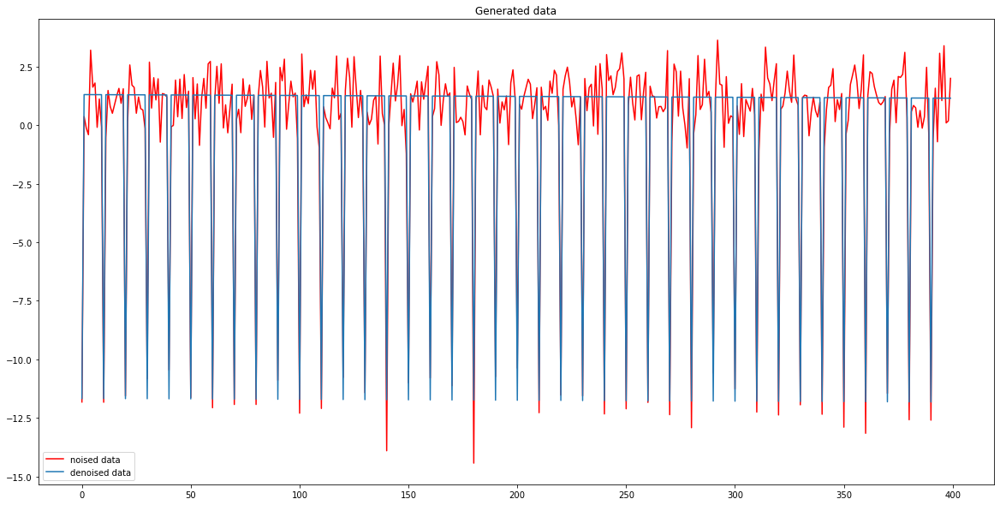
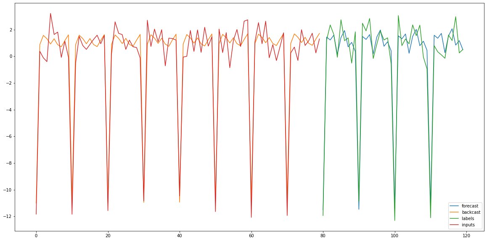
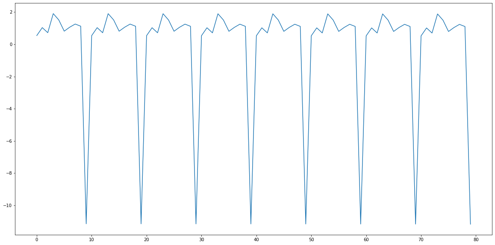
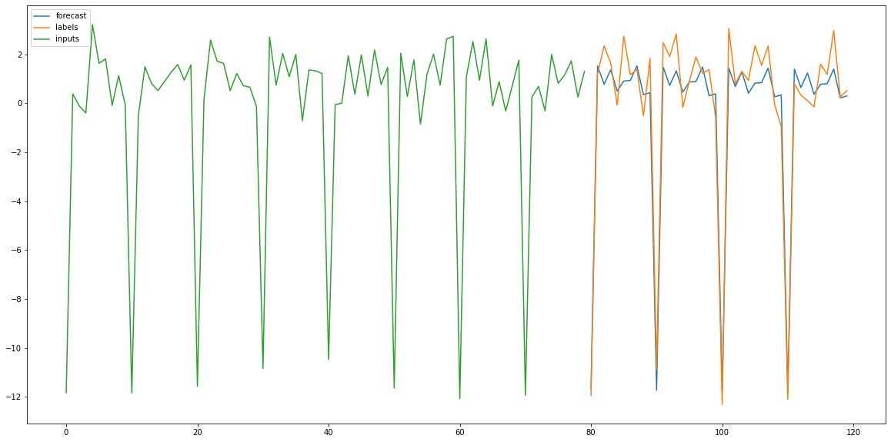

# Welcome to Autopycoin
---


[](https://circleci.com/gh/AutocoinLab/autopycoin/tree/main)
[](https://codecov.io/gh/AutocoinLab/autopycoin)
[](https://autopycoin.readthedocs.io/en/latest/?badge=latest)


This is a deep learning package based on tensorflow and 
maintained by a group of french students and used in a their final master project.
All the models are the Unofficial implementations.

# Available Models
---

```python
from autopycoin.models import create_interpretable_nbeats, create_interpretable_nbeats, NBEATS, PoolNBEATS
```

| Model         | epistemic error | Aleotoric error | Paper |
|--------------|-----------|------------|------------|
| NBEATS |  Dropout or bagging   | Quantiles |  [Paper](https://arxiv.org/abs/1905.10437)|


# Available Losses
---

```python
from autopycoin.losses import QuantileLossError, SymetricMeanAbsolutePercentageError
```

| Losses         |
|--------------|
| QuantileLosseError |
| SymetricMeanAbsolutePercentageError |

# Dataset maker
---

```python
from autopycoin.dataset import WindowGenerator
```

| Dataset maker|
|--------------|
| WindowGenerator|

# How to use autopycoin
---

```
pip install autopycoin
```

# How to use Autopycoin

This notebook is a quick start for autopycoin. We will demonstrate its efficiency through a toy example.

## Import

As our package is based on tensorflow we need to import it.


```python
import tensorflow as tf
```

Let's create our data thanks to `random_ts` which generate a fake time serie based on a trend and seasonality components.


```python
from autopycoin.data import random_ts

tf.random.set_seed(0)

data = random_ts(n_steps=400, # Number of steps (second dimension)
                 trend_degree=2,
                 periods=[10], # We can combine multiple periods, period is the time length for a cyclical function to reproduce a similar output
                 fourier_orders=[10], # higher is this number, more complex is the output
                 trend_mean=0,
                 trend_std=1,
                 seasonality_mean=0,
                 seasonality_std=1, 
                 batch_size=1, # Generate a batch of data (first dimension)
                 n_variables=1, # Number of variables (last dimension)
                 noise=True, # add normal centered noise
                 seed=42)

denoised_data = random_ts(n_steps=400, # Number of steps (second dimension)
                 trend_degree=2,
                 periods=[10], # We can combine multiple periods, period is the time length for a cyclical function to reproduce a similar output
                 fourier_orders=[10], # higher is this number, more complex is the output
                 trend_mean=0,
                 trend_std=1,
                 seasonality_mean=0,
                 seasonality_std=1, 
                 batch_size=1, # Generate a batch of data (first dimension)
                 n_variables=1, # Number of variables (last dimension)
                 noise=False, # add normal centered noise
                 seed=42)

# Let's render it with matplotlib
import matplotlib.pyplot as plt

plt.rcParams['figure.figsize'] = (20, 10)
plt.plot(data[0], c='r', label='noised data')
plt.plot(denoised_data[0], label='denoised data')
plt.title('Generated data')
plt.legend()
```


    <matplotlib.legend.Legend at 0x25a4597b040>


    

    


# Tensorflow library

Tensorflow use `dataset` to feed its models. Hence, we create an object `WindowGenerator` to facilitate the creation of training, validation and training set.


```python
from autopycoin.dataset import WindowGenerator
```

We first create an instance of `Windowgenerator` by defining important parameters value.
By defining an `input_width` of 70, we set our input length.
 - `label_width` set our label length.
 - `shift` represents the shift between label and input data. Hence if you don't want label and input overlapping `shift` has to be equal to   `label_width`. It can help for more complex model like lstm models which can be trained to reconstruct their inputs.
 - `test_size` and `valid_size` are the numbers of examples to predict. If they are integer, they are the true number of examples, if they are float then it's a proportion of the entire data.

Note: We create lot of examples by shifting by one the window of prediction.


```python
w = WindowGenerator(
        input_width=80,
        label_width=40,
        shift=40,
        test_size=50,
        valid_size=10,
        flat=True,
        batch_size=16,
        preprocessing = lambda x,y: (x, (x,y)) # NBEATS output
    )

```

We can't use it now as it needs to be initialized by an array, tensor or a dataframe


```python
w = w.from_array(data=data[0], # Has to be 2D array
        input_columns=[0],
        known_columns=[],
        label_columns=[0],
        date_columns=[],)

# Or using dataframe
import pandas as pd

data = pd.DataFrame(data.numpy()[0], columns=['test'])

w = w.from_array(data=data, # Has to be 2D array
        input_columns=['test'],
        known_columns=[],
        label_columns=['test'],
        date_columns=[],)

```


```python
w.train
```


    <BatchDataset element_spec=(TensorSpec(shape=(None, 80), dtype=tf.float32, name=None), (TensorSpec(shape=(None, 80), dtype=tf.float32, name=None), TensorSpec(shape=(None, 40), dtype=tf.float32, name=None)))>


```python
w.valid
```


    <BatchDataset element_spec=(TensorSpec(shape=(None, 80), dtype=tf.float32, name=None), (TensorSpec(shape=(None, 80), dtype=tf.float32, name=None), TensorSpec(shape=(None, 40), dtype=tf.float32, name=None)))>


```python
w.test
```


    <BatchDataset element_spec=(TensorSpec(shape=(None, 80), dtype=tf.float32, name=None), (TensorSpec(shape=(None, 80), dtype=tf.float32, name=None), TensorSpec(shape=(None, 40), dtype=tf.float32, name=None)))>


# It's time for inference

We import the nbeats module where the nbdeats model is defined.

There are currently multiple version of nbeats implemented as `create_interpretable_nbeats` or `create_generic_nbeats`.
But it is possible to customize it's own nbeats model by subclassing the nbeats Model and Layer.


```python
from autopycoin.models import nbeats

model1 = nbeats.create_interpretable_nbeats(
            label_width=40,
            forecast_periods=[10],
            backcast_periods=[10],
            forecast_fourier_order=[10],
            backcast_fourier_order=[10],
            p_degree=1,
            trend_n_neurons=200,
            seasonality_n_neurons=200,
            drop_rate=0.,
            share=True)

model1.compile(tf.keras.optimizers.Adam(
    learning_rate=0.0015, beta_1=0.9, beta_2=0.999, epsilon=1e-07, amsgrad=True,
    name='Adam'), 
    loss='mse', 
    loss_weights=[1, 1], # In the paper = [0, 1]
    metrics=["mae"])

model1.fit(w.train, validation_data=w.valid, epochs=20)
```

    Epoch 1/20
    9/9 [==============================] - 10s 264ms/step - loss: 107.7595 - output_1_loss: 48.8508 - output_2_loss: 58.9087 - output_1_mae: 4.6331 - output_2_mae: 5.6065 - val_loss: 28.2610 - val_output_1_loss: 6.3400 - val_output_2_loss: 21.9210 - val_output_1_mae: 2.0182 - val_output_2_mae: 3.4445
    Epoch 2/20
    9/9 [==============================] - 0s 28ms/step - loss: 17.0173 - output_1_loss: 5.0084 - output_2_loss: 12.0089 - output_1_mae: 1.7634 - output_2_mae: 2.6280 - val_loss: 9.0327 - val_output_1_loss: 3.2561 - val_output_2_loss: 5.7766 - val_output_1_mae: 1.4348 - val_output_2_mae: 1.9232
    Epoch 3/20
    9/9 [==============================] - 0s 31ms/step - loss: 7.7175 - output_1_loss: 2.6491 - output_2_loss: 5.0685 - output_1_mae: 1.2985 - output_2_mae: 1.7502 - val_loss: 4.7811 - val_output_1_loss: 1.9094 - val_output_2_loss: 2.8717 - val_output_1_mae: 1.1005 - val_output_2_mae: 1.3431
    Epoch 4/20
    9/9 [==============================] - 0s 31ms/step - loss: 4.4976 - output_1_loss: 1.9064 - output_2_loss: 2.5912 - output_1_mae: 1.1020 - output_2_mae: 1.2652 - val_loss: 4.1069 - val_output_1_loss: 1.5517 - val_output_2_loss: 2.5552 - val_output_1_mae: 0.9765 - val_output_2_mae: 1.3012
    Epoch 5/20
    9/9 [==============================] - 0s 30ms/step - loss: 3.3197 - output_1_loss: 1.4996 - output_2_loss: 1.8201 - output_1_mae: 0.9801 - output_2_mae: 1.0888 - val_loss: 3.4868 - val_output_1_loss: 1.3489 - val_output_2_loss: 2.1379 - val_output_1_mae: 0.9232 - val_output_2_mae: 1.1573
    Epoch 6/20
    9/9 [==============================] - 0s 31ms/step - loss: 2.8041 - output_1_loss: 1.3137 - output_2_loss: 1.4904 - output_1_mae: 0.9224 - output_2_mae: 0.9713 - val_loss: 3.0279 - val_output_1_loss: 1.1370 - val_output_2_loss: 1.8908 - val_output_1_mae: 0.8540 - val_output_2_mae: 1.0975
    Epoch 7/20
    9/9 [==============================] - 0s 31ms/step - loss: 2.5440 - output_1_loss: 1.2236 - output_2_loss: 1.3204 - output_1_mae: 0.8918 - output_2_mae: 0.9265 - val_loss: 2.9015 - val_output_1_loss: 1.0745 - val_output_2_loss: 1.8270 - val_output_1_mae: 0.8283 - val_output_2_mae: 1.0760
    Epoch 8/20
    9/9 [==============================] - 0s 30ms/step - loss: 2.4074 - output_1_loss: 1.1735 - output_2_loss: 1.2339 - output_1_mae: 0.8744 - output_2_mae: 0.8928 - val_loss: 2.8078 - val_output_1_loss: 1.0035 - val_output_2_loss: 1.8042 - val_output_1_mae: 0.8019 - val_output_2_mae: 1.0765
    Epoch 9/20
    9/9 [==============================] - 0s 33ms/step - loss: 2.2903 - output_1_loss: 1.1395 - output_2_loss: 1.1508 - output_1_mae: 0.8615 - output_2_mae: 0.8617 - val_loss: 2.7515 - val_output_1_loss: 0.9931 - val_output_2_loss: 1.7584 - val_output_1_mae: 0.7983 - val_output_2_mae: 1.0654
    Epoch 10/20
    9/9 [==============================] - 0s 42ms/step - loss: 2.2125 - output_1_loss: 1.1157 - output_2_loss: 1.0968 - output_1_mae: 0.8529 - output_2_mae: 0.8449 - val_loss: 2.7506 - val_output_1_loss: 0.9789 - val_output_2_loss: 1.7718 - val_output_1_mae: 0.7917 - val_output_2_mae: 1.0708
    Epoch 11/20
    9/9 [==============================] - 0s 34ms/step - loss: 2.1483 - output_1_loss: 1.0973 - output_2_loss: 1.0510 - output_1_mae: 0.8459 - output_2_mae: 0.8261 - val_loss: 2.6904 - val_output_1_loss: 0.9565 - val_output_2_loss: 1.7339 - val_output_1_mae: 0.7839 - val_output_2_mae: 1.0580
    Epoch 12/20
    9/9 [==============================] - 0s 31ms/step - loss: 2.0970 - output_1_loss: 1.0808 - output_2_loss: 1.0162 - output_1_mae: 0.8401 - output_2_mae: 0.8130 - val_loss: 2.6640 - val_output_1_loss: 0.9480 - val_output_2_loss: 1.7161 - val_output_1_mae: 0.7820 - val_output_2_mae: 1.0537
    Epoch 13/20
    9/9 [==============================] - 0s 29ms/step - loss: 2.0540 - output_1_loss: 1.0680 - output_2_loss: 0.9860 - output_1_mae: 0.8356 - output_2_mae: 0.8008 - val_loss: 2.6468 - val_output_1_loss: 0.9326 - val_output_2_loss: 1.7142 - val_output_1_mae: 0.7754 - val_output_2_mae: 1.0538
    Epoch 14/20
    9/9 [==============================] - 0s 29ms/step - loss: 2.0171 - output_1_loss: 1.0562 - output_2_loss: 0.9609 - output_1_mae: 0.8310 - output_2_mae: 0.7910 - val_loss: 2.6439 - val_output_1_loss: 0.9350 - val_output_2_loss: 1.7090 - val_output_1_mae: 0.7752 - val_output_2_mae: 1.0473
    Epoch 15/20
    9/9 [==============================] - 0s 29ms/step - loss: 1.9864 - output_1_loss: 1.0468 - output_2_loss: 0.9396 - output_1_mae: 0.8273 - output_2_mae: 0.7809 - val_loss: 2.6282 - val_output_1_loss: 0.9284 - val_output_2_loss: 1.6998 - val_output_1_mae: 0.7728 - val_output_2_mae: 1.0454
    Epoch 16/20
    9/9 [==============================] - 0s 30ms/step - loss: 1.9587 - output_1_loss: 1.0372 - output_2_loss: 0.9215 - output_1_mae: 0.8237 - output_2_mae: 0.7729 - val_loss: 2.6171 - val_output_1_loss: 0.9228 - val_output_2_loss: 1.6943 - val_output_1_mae: 0.7705 - val_output_2_mae: 1.0443
    Epoch 17/20
    9/9 [==============================] - 0s 36ms/step - loss: 1.9331 - output_1_loss: 1.0287 - output_2_loss: 0.9045 - output_1_mae: 0.8206 - output_2_mae: 0.7672 - val_loss: 2.6150 - val_output_1_loss: 0.9207 - val_output_2_loss: 1.6943 - val_output_1_mae: 0.7690 - val_output_2_mae: 1.0435
    Epoch 18/20
    9/9 [==============================] - 0s 31ms/step - loss: 1.9092 - output_1_loss: 1.0210 - output_2_loss: 0.8882 - output_1_mae: 0.8180 - output_2_mae: 0.7597 - val_loss: 2.5927 - val_output_1_loss: 0.9081 - val_output_2_loss: 1.6846 - val_output_1_mae: 0.7642 - val_output_2_mae: 1.0409
    Epoch 19/20
    9/9 [==============================] - 0s 30ms/step - loss: 1.8908 - output_1_loss: 1.0147 - output_2_loss: 0.8761 - output_1_mae: 0.8155 - output_2_mae: 0.7552 - val_loss: 2.6052 - val_output_1_loss: 0.9144 - val_output_2_loss: 1.6908 - val_output_1_mae: 0.7666 - val_output_2_mae: 1.0435
    Epoch 20/20
    9/9 [==============================] - 0s 31ms/step - loss: 1.8719 - output_1_loss: 1.0081 - output_2_loss: 0.8638 - output_1_mae: 0.8130 - output_2_mae: 0.7485 - val_loss: 2.6011 - val_output_1_loss: 0.9084 - val_output_2_loss: 1.6927 - val_output_1_mae: 0.7635 - val_output_2_mae: 1.0453
    


    <keras.callbacks.History at 0x25a4268de20>


```python
from autopycoin.models import nbeats

model2 = nbeats.create_generic_nbeats(
            label_width=40,
            g_forecast_neurons=16, 
            g_backcast_neurons=16, 
            n_neurons=16, 
            n_blocks=3,
            n_stacks=2,
            drop_rate=0.1,
            share=True)

model2.compile(tf.keras.optimizers.Adam(
    learning_rate=0.0015, beta_1=0.9, beta_2=0.999, epsilon=1e-07, amsgrad=True,
    name='Adam'), loss='mse', 
    loss_weights=[1, 1], # In the paper = [0, 1]
    metrics=["mae"])

model2.fit(w.train, validation_data=w.valid, epochs=20)
```

    Epoch 1/20
    9/9 [==============================] - 10s 273ms/step - loss: 42.6128 - output_1_loss: 20.5989 - output_2_loss: 22.0138 - output_1_mae: 2.9896 - output_2_mae: 3.3102 - val_loss: 35.9356 - val_output_1_loss: 17.8830 - val_output_2_loss: 18.0526 - val_output_1_mae: 2.7465 - val_output_2_mae: 2.8812
    Epoch 2/20
    9/9 [==============================] - 0s 34ms/step - loss: 33.6867 - output_1_loss: 16.9436 - output_2_loss: 16.7431 - output_1_mae: 2.5379 - output_2_mae: 2.6609 - val_loss: 32.3713 - val_output_1_loss: 16.0248 - val_output_2_loss: 16.3464 - val_output_1_mae: 2.5090 - val_output_2_mae: 2.4740
    Epoch 3/20
    9/9 [==============================] - 0s 35ms/step - loss: 31.6279 - output_1_loss: 16.0887 - output_2_loss: 15.5393 - output_1_mae: 2.4137 - output_2_mae: 2.4602 - val_loss: 31.0422 - val_output_1_loss: 15.9003 - val_output_2_loss: 15.1419 - val_output_1_mae: 2.4889 - val_output_2_mae: 2.3757
    Epoch 4/20
    9/9 [==============================] - 0s 38ms/step - loss: 30.7158 - output_1_loss: 15.7325 - output_2_loss: 14.9833 - output_1_mae: 2.3807 - output_2_mae: 2.4034 - val_loss: 30.2672 - val_output_1_loss: 15.5197 - val_output_2_loss: 14.7476 - val_output_1_mae: 2.4714 - val_output_2_mae: 2.3704
    Epoch 5/20
    9/9 [==============================] - 0s 36ms/step - loss: 29.9507 - output_1_loss: 15.4581 - output_2_loss: 14.4926 - output_1_mae: 2.3601 - output_2_mae: 2.3899 - val_loss: 29.1492 - val_output_1_loss: 15.3752 - val_output_2_loss: 13.7740 - val_output_1_mae: 2.4536 - val_output_2_mae: 2.3348
    Epoch 6/20
    9/9 [==============================] - 0s 37ms/step - loss: 28.9890 - output_1_loss: 15.2142 - output_2_loss: 13.7748 - output_1_mae: 2.3620 - output_2_mae: 2.3576 - val_loss: 27.7325 - val_output_1_loss: 14.7231 - val_output_2_loss: 13.0094 - val_output_1_mae: 2.4348 - val_output_2_mae: 2.3628
    Epoch 7/20
    9/9 [==============================] - 0s 37ms/step - loss: 27.9566 - output_1_loss: 14.8224 - output_2_loss: 13.1342 - output_1_mae: 2.3521 - output_2_mae: 2.3442 - val_loss: 27.0617 - val_output_1_loss: 14.4031 - val_output_2_loss: 12.6587 - val_output_1_mae: 2.4278 - val_output_2_mae: 2.3942
    Epoch 8/20
    9/9 [==============================] - 0s 38ms/step - loss: 26.8509 - output_1_loss: 14.4216 - output_2_loss: 12.4294 - output_1_mae: 2.3607 - output_2_mae: 2.3420 - val_loss: 26.5709 - val_output_1_loss: 14.1705 - val_output_2_loss: 12.4004 - val_output_1_mae: 2.4366 - val_output_2_mae: 2.4046
    Epoch 9/20
    9/9 [==============================] - 0s 45ms/step - loss: 25.5537 - output_1_loss: 13.9055 - output_2_loss: 11.6482 - output_1_mae: 2.3517 - output_2_mae: 2.2923 - val_loss: 25.4198 - val_output_1_loss: 13.6695 - val_output_2_loss: 11.7503 - val_output_1_mae: 2.4041 - val_output_2_mae: 2.2838
    Epoch 10/20
    9/9 [==============================] - 0s 39ms/step - loss: 24.2401 - output_1_loss: 13.3442 - output_2_loss: 10.8959 - output_1_mae: 2.3349 - output_2_mae: 2.2453 - val_loss: 24.0776 - val_output_1_loss: 12.8328 - val_output_2_loss: 11.2448 - val_output_1_mae: 2.4019 - val_output_2_mae: 2.3412
    Epoch 11/20
    9/9 [==============================] - 0s 39ms/step - loss: 22.8726 - output_1_loss: 12.5804 - output_2_loss: 10.2922 - output_1_mae: 2.3036 - output_2_mae: 2.2185 - val_loss: 22.0797 - val_output_1_loss: 11.8361 - val_output_2_loss: 10.2435 - val_output_1_mae: 2.3351 - val_output_2_mae: 2.2578
    Epoch 12/20
    9/9 [==============================] - 0s 37ms/step - loss: 21.3568 - output_1_loss: 11.8595 - output_2_loss: 9.4973 - output_1_mae: 2.2715 - output_2_mae: 2.1294 - val_loss: 20.7301 - val_output_1_loss: 11.2053 - val_output_2_loss: 9.5248 - val_output_1_mae: 2.2682 - val_output_2_mae: 2.1940
    Epoch 13/20
    9/9 [==============================] - 0s 37ms/step - loss: 19.9969 - output_1_loss: 10.9618 - output_2_loss: 9.0351 - output_1_mae: 2.2187 - output_2_mae: 2.1088 - val_loss: 19.5411 - val_output_1_loss: 10.4076 - val_output_2_loss: 9.1335 - val_output_1_mae: 2.2347 - val_output_2_mae: 2.1147
    Epoch 14/20
    9/9 [==============================] - 0s 39ms/step - loss: 18.2909 - output_1_loss: 10.0314 - output_2_loss: 8.2595 - output_1_mae: 2.1757 - output_2_mae: 2.0099 - val_loss: 17.4031 - val_output_1_loss: 9.2104 - val_output_2_loss: 8.1927 - val_output_1_mae: 2.1068 - val_output_2_mae: 1.9743
    Epoch 15/20
    9/9 [==============================] - 0s 38ms/step - loss: 16.9036 - output_1_loss: 9.1755 - output_2_loss: 7.7281 - output_1_mae: 2.1134 - output_2_mae: 1.9526 - val_loss: 15.8572 - val_output_1_loss: 8.1932 - val_output_2_loss: 7.6641 - val_output_1_mae: 2.0244 - val_output_2_mae: 1.9575
    Epoch 16/20
    9/9 [==============================] - 0s 37ms/step - loss: 15.6807 - output_1_loss: 8.4435 - output_2_loss: 7.2372 - output_1_mae: 2.0389 - output_2_mae: 1.8990 - val_loss: 15.5640 - val_output_1_loss: 8.1138 - val_output_2_loss: 7.4503 - val_output_1_mae: 2.0440 - val_output_2_mae: 1.9175
    Epoch 17/20
    9/9 [==============================] - 0s 39ms/step - loss: 14.5375 - output_1_loss: 7.7209 - output_2_loss: 6.8166 - output_1_mae: 1.9561 - output_2_mae: 1.8343 - val_loss: 14.9077 - val_output_1_loss: 7.8515 - val_output_2_loss: 7.0563 - val_output_1_mae: 2.0159 - val_output_2_mae: 1.8616
    Epoch 18/20
    9/9 [==============================] - 0s 39ms/step - loss: 13.4057 - output_1_loss: 7.0658 - output_2_loss: 6.3399 - output_1_mae: 1.9002 - output_2_mae: 1.7726 - val_loss: 12.9685 - val_output_1_loss: 6.5909 - val_output_2_loss: 6.3776 - val_output_1_mae: 1.8825 - val_output_2_mae: 1.8605
    Epoch 19/20
    9/9 [==============================] - 0s 37ms/step - loss: 11.6256 - output_1_loss: 6.0771 - output_2_loss: 5.5485 - output_1_mae: 1.7945 - output_2_mae: 1.6762 - val_loss: 11.7937 - val_output_1_loss: 6.1221 - val_output_2_loss: 5.6716 - val_output_1_mae: 1.8922 - val_output_2_mae: 1.7786
    Epoch 20/20
    9/9 [==============================] - 0s 39ms/step - loss: 11.2368 - output_1_loss: 5.8081 - output_2_loss: 5.4287 - output_1_mae: 1.7738 - output_2_mae: 1.6614 - val_loss: 10.8702 - val_output_1_loss: 5.4575 - val_output_2_loss: 5.4126 - val_output_1_mae: 1.7811 - val_output_2_mae: 1.7010
    


    <keras.callbacks.History at 0x25a4c7eb3d0>


# Evaluation


```python
model1.evaluate(w.test)
```

    4/4 [==============================] - 0s 15ms/step - loss: 2.6927 - output_1_loss: 1.2548 - output_2_loss: 1.4379 - output_1_mae: 0.8934 - output_2_mae: 0.9630
    


    [2.692697048187256,
     1.2548267841339111,
     1.4378703832626343,
     0.8934133052825928,
     0.9630153179168701]


```python
model2.evaluate(w.test)
```

    4/4 [==============================] - 0s 20ms/step - loss: 10.9378 - output_1_loss: 5.5514 - output_2_loss: 5.3864 - output_1_mae: 1.7609 - output_2_mae: 1.6672
    


    [10.937788963317871,
     5.551424503326416,
     5.386363506317139,
     1.7609360218048096,
     1.66715669631958]


# Plot

Let plot some previsions


```python
import matplotlib.pyplot as plt

iterator = iter(w.train)
x, y = iterator.get_next()

input_width = 80

plt.plot(range(input_width, input_width + 40), model1.predict(x)[1].values[0], label='forecast')
# Usefull only if stack = True
plt.plot(range(input_width), model1.predict(x)[0].values[0], label='backcast')
plt.plot(range(input_width, input_width + 40), y[1][0], label='labels')
plt.plot(range(input_width), x[0], label='inputs')
plt.legend()
```


    <matplotlib.legend.Legend at 0x25a5293e4f0>


    

    


# Production


```python
prod = w.production(data)
plt.plot(model1.predict(prod)[0].values[1])
```


    [<matplotlib.lines.Line2D at 0x25a5363f2b0>]


    

    


# A pool is better than a single model

Generally, a pool is better than a single model : It is a regularization method.
In this toy example, it won't because we are not optimizing the training phase.


```python
from autopycoin.models import PoolNBEATS

# Create a callable which define label_width and create a Tensorflow Model.
model = lambda label_width: nbeats.create_interpretable_nbeats(
            label_width=label_width,
            forecast_periods=[10],
            backcast_periods=[10],
            forecast_fourier_order=[10],
            backcast_fourier_order=[10],
            p_degree=1,
            trend_n_neurons=200,
            seasonality_n_neurons=200,
            drop_rate=0.,
            share=True)

# Define an aggregation method with fn_agg, the number of models with n_models and the 
# label width with label_width. label_width is mandatory if you use callables in nbeats_models !
model = PoolNBEATS(n_models=3, label_width=40, nbeats_models=model,
            fn_agg=tf.reduce_mean)

model.compile(tf.keras.optimizers.Adam(
    learning_rate=0.001, beta_1=0.9, beta_2=0.999, epsilon=1e-07, amsgrad=True,
    name='Adam'), loss=['mse'], metrics=['mae'])

# The fit is printing 6 different maes results: 2 for each model (backcast, forecast).
# The loss is aggregated then it is printing 4 loss results: 1 for the entire model, 
model.fit(w.train, validation_data=w.valid, epochs=20)
```

    Epoch 1/20
    9/9 [==============================] - 43s 829ms/step - loss: 129.9779 - output_1_1_loss: 54.8111 - output_1_2_loss: 58.6071 - output_2_1_loss: 16.5597 - output_1_1_mae: 5.1632 - output_1_2_mae: 5.4097 - output_2_1_mae: 3.1162 - output_2_2_mae: 3.6870 - output_3_1_mae: 4.8781 - output_3_2_mae: 4.5370 - val_loss: 46.9568 - val_output_1_1_loss: 14.0975 - val_output_1_2_loss: 24.6893 - val_output_2_1_loss: 8.1700 - val_output_1_1_mae: 2.9376 - val_output_1_2_mae: 3.7093 - val_output_2_1_mae: 2.3219 - val_output_2_2_mae: 2.5332 - val_output_3_1_mae: 3.8348 - val_output_3_2_mae: 3.3322
    Epoch 2/20
    9/9 [==============================] - 1s 74ms/step - loss: 25.4214 - output_1_1_loss: 7.0674 - output_1_2_loss: 14.4327 - output_2_1_loss: 3.9213 - output_1_1_mae: 2.0938 - output_1_2_mae: 2.8991 - output_2_1_mae: 1.5464 - output_2_2_mae: 1.9865 - output_3_1_mae: 2.3966 - output_3_2_mae: 2.8036 - val_loss: 17.6809 - val_output_1_1_loss: 4.1897 - val_output_1_2_loss: 11.3001 - val_output_2_1_loss: 2.1912 - val_output_1_1_mae: 1.6525 - val_output_1_2_mae: 2.6448 - val_output_2_1_mae: 1.1933 - val_output_2_2_mae: 1.8943 - val_output_3_1_mae: 1.8263 - val_output_3_2_mae: 2.2586
    Epoch 3/20
    9/9 [==============================] - 1s 86ms/step - loss: 11.8408 - output_1_1_loss: 3.4665 - output_1_2_loss: 6.3762 - output_2_1_loss: 1.9981 - output_1_1_mae: 1.4820 - output_1_2_mae: 1.9251 - output_2_1_mae: 1.1135 - output_2_2_mae: 1.4251 - output_3_1_mae: 1.5350 - output_3_2_mae: 1.9391 - val_loss: 8.2325 - val_output_1_1_loss: 2.1980 - val_output_1_2_loss: 4.5575 - val_output_2_1_loss: 1.4771 - val_output_1_1_mae: 1.2003 - val_output_1_2_mae: 1.7161 - val_output_2_1_mae: 0.9559 - val_output_2_2_mae: 1.8211 - val_output_3_1_mae: 1.4079 - val_output_3_2_mae: 1.7984
    Epoch 4/20
    9/9 [==============================] - 1s 90ms/step - loss: 6.9427 - output_1_1_loss: 2.2510 - output_1_2_loss: 3.3005 - output_2_1_loss: 1.3912 - output_1_1_mae: 1.2012 - output_1_2_mae: 1.4370 - output_2_1_mae: 0.9312 - output_2_2_mae: 1.2682 - output_3_1_mae: 1.2522 - output_3_2_mae: 1.3777 - val_loss: 5.8157 - val_output_1_1_loss: 1.7247 - val_output_1_2_loss: 3.0949 - val_output_2_1_loss: 0.9962 - val_output_1_1_mae: 1.0654 - val_output_1_2_mae: 1.3998 - val_output_2_1_mae: 0.7977 - val_output_2_2_mae: 1.6829 - val_output_3_1_mae: 1.1519 - val_output_3_2_mae: 1.4012
    Epoch 5/20
    9/9 [==============================] - 1s 86ms/step - loss: 5.0599 - output_1_1_loss: 1.7671 - output_1_2_loss: 2.1756 - output_2_1_loss: 1.1172 - output_1_1_mae: 1.0628 - output_1_2_mae: 1.1825 - output_2_1_mae: 0.8378 - output_2_2_mae: 1.4185 - output_3_1_mae: 1.0667 - output_3_2_mae: 1.1119 - val_loss: 4.7978 - val_output_1_1_loss: 1.3100 - val_output_1_2_loss: 2.6150 - val_output_2_1_loss: 0.8728 - val_output_1_1_mae: 0.9288 - val_output_1_2_mae: 1.3082 - val_output_2_1_mae: 0.7442 - val_output_2_2_mae: 1.0579 - val_output_3_1_mae: 0.9992 - val_output_3_2_mae: 1.2378
    Epoch 6/20
    9/9 [==============================] - 1s 87ms/step - loss: 4.2656 - output_1_1_loss: 1.4522 - output_1_2_loss: 1.7817 - output_2_1_loss: 1.0316 - output_1_1_mae: 0.9619 - output_1_2_mae: 1.0819 - output_2_1_mae: 0.8059 - output_2_2_mae: 1.3582 - output_3_1_mae: 0.9386 - output_3_2_mae: 1.0177 - val_loss: 3.9572 - val_output_1_1_loss: 1.1128 - val_output_1_2_loss: 2.0426 - val_output_2_1_loss: 0.8018 - val_output_1_1_mae: 0.8523 - val_output_1_2_mae: 1.1461 - val_output_2_1_mae: 0.7204 - val_output_2_2_mae: 1.6967 - val_output_3_1_mae: 0.8754 - val_output_3_2_mae: 1.1660
    Epoch 7/20
    9/9 [==============================] - 1s 100ms/step - loss: 3.8616 - output_1_1_loss: 1.3152 - output_1_2_loss: 1.5499 - output_2_1_loss: 0.9965 - output_1_1_mae: 0.9157 - output_1_2_mae: 1.0036 - output_2_1_mae: 0.7941 - output_2_2_mae: 1.1896 - output_3_1_mae: 0.8731 - output_3_2_mae: 0.9514 - val_loss: 3.8208 - val_output_1_1_loss: 1.0152 - val_output_1_2_loss: 2.0275 - val_output_2_1_loss: 0.7781 - val_output_1_1_mae: 0.8203 - val_output_1_2_mae: 1.1385 - val_output_2_1_mae: 0.7071 - val_output_2_2_mae: 1.2886 - val_output_3_1_mae: 0.8086 - val_output_3_2_mae: 1.1600
    Epoch 8/20
    9/9 [==============================] - 1s 102ms/step - loss: 3.5669 - output_1_1_loss: 1.2355 - output_1_2_loss: 1.3619 - output_2_1_loss: 0.9696 - output_1_1_mae: 0.8884 - output_1_2_mae: 0.9339 - output_2_1_mae: 0.7838 - output_2_2_mae: 0.9751 - output_3_1_mae: 0.8383 - output_3_2_mae: 0.9076 - val_loss: 3.5757 - val_output_1_1_loss: 0.9730 - val_output_1_2_loss: 1.8360 - val_output_2_1_loss: 0.7667 - val_output_1_1_mae: 0.8063 - val_output_1_2_mae: 1.0796 - val_output_2_1_mae: 0.7042 - val_output_2_2_mae: 1.0481 - val_output_3_1_mae: 0.7874 - val_output_3_2_mae: 1.1607
    Epoch 9/20
    9/9 [==============================] - 1s 90ms/step - loss: 3.3985 - output_1_1_loss: 1.1943 - output_1_2_loss: 1.2635 - output_2_1_loss: 0.9407 - output_1_1_mae: 0.8756 - output_1_2_mae: 0.8978 - output_2_1_mae: 0.7717 - output_2_2_mae: 0.8747 - output_3_1_mae: 0.8182 - output_3_2_mae: 0.8798 - val_loss: 3.6140 - val_output_1_1_loss: 0.9473 - val_output_1_2_loss: 1.9000 - val_output_2_1_loss: 0.7666 - val_output_1_1_mae: 0.7956 - val_output_1_2_mae: 1.0952 - val_output_2_1_mae: 0.7048 - val_output_2_2_mae: 1.0705 - val_output_3_1_mae: 0.7708 - val_output_3_2_mae: 1.1711
    Epoch 10/20
    9/9 [==============================] - 1s 88ms/step - loss: 3.2628 - output_1_1_loss: 1.1613 - output_1_2_loss: 1.1828 - output_2_1_loss: 0.9187 - output_1_1_mae: 0.8640 - output_1_2_mae: 0.8752 - output_2_1_mae: 0.7643 - output_2_2_mae: 0.8340 - output_3_1_mae: 0.8036 - output_3_2_mae: 0.8597 - val_loss: 3.6254 - val_output_1_1_loss: 0.9419 - val_output_1_2_loss: 1.9278 - val_output_2_1_loss: 0.7556 - val_output_1_1_mae: 0.7926 - val_output_1_2_mae: 1.1058 - val_output_2_1_mae: 0.7003 - val_output_2_2_mae: 1.0737 - val_output_3_1_mae: 0.7666 - val_output_3_2_mae: 1.1687
    Epoch 11/20
    9/9 [==============================] - 1s 86ms/step - loss: 3.1657 - output_1_1_loss: 1.1376 - output_1_2_loss: 1.1247 - output_2_1_loss: 0.9034 - output_1_1_mae: 0.8553 - output_1_2_mae: 0.8621 - output_2_1_mae: 0.7592 - output_2_2_mae: 0.8126 - output_3_1_mae: 0.7948 - output_3_2_mae: 0.8450 - val_loss: 3.5362 - val_output_1_1_loss: 0.9206 - val_output_1_2_loss: 1.8659 - val_output_2_1_loss: 0.7497 - val_output_1_1_mae: 0.7823 - val_output_1_2_mae: 1.0899 - val_output_2_1_mae: 0.6958 - val_output_2_2_mae: 1.0339 - val_output_3_1_mae: 0.7653 - val_output_3_2_mae: 1.1516
    Epoch 12/20
    9/9 [==============================] - 1s 87ms/step - loss: 3.1066 - output_1_1_loss: 1.1205 - output_1_2_loss: 1.0941 - output_2_1_loss: 0.8920 - output_1_1_mae: 0.8487 - output_1_2_mae: 0.8511 - output_2_1_mae: 0.7547 - output_2_2_mae: 0.7885 - output_3_1_mae: 0.7868 - output_3_2_mae: 0.8316 - val_loss: 3.4825 - val_output_1_1_loss: 0.9152 - val_output_1_2_loss: 1.8193 - val_output_2_1_loss: 0.7479 - val_output_1_1_mae: 0.7806 - val_output_1_2_mae: 1.0748 - val_output_2_1_mae: 0.6967 - val_output_2_2_mae: 1.0604 - val_output_3_1_mae: 0.7619 - val_output_3_2_mae: 1.1315
    Epoch 13/20
    9/9 [==============================] - 1s 89ms/step - loss: 3.0458 - output_1_1_loss: 1.1044 - output_1_2_loss: 1.0592 - output_2_1_loss: 0.8822 - output_1_1_mae: 0.8432 - output_1_2_mae: 0.8309 - output_2_1_mae: 0.7507 - output_2_2_mae: 0.7824 - output_3_1_mae: 0.7802 - output_3_2_mae: 0.8183 - val_loss: 3.5015 - val_output_1_1_loss: 0.9050 - val_output_1_2_loss: 1.8511 - val_output_2_1_loss: 0.7454 - val_output_1_1_mae: 0.7771 - val_output_1_2_mae: 1.0792 - val_output_2_1_mae: 0.6925 - val_output_2_2_mae: 1.0433 - val_output_3_1_mae: 0.7592 - val_output_3_2_mae: 1.1145
    Epoch 14/20
    9/9 [==============================] - 1s 88ms/step - loss: 2.9937 - output_1_1_loss: 1.0914 - output_1_2_loss: 1.0284 - output_2_1_loss: 0.8740 - output_1_1_mae: 0.8393 - output_1_2_mae: 0.8118 - output_2_1_mae: 0.7473 - output_2_2_mae: 0.7690 - output_3_1_mae: 0.7750 - output_3_2_mae: 0.8043 - val_loss: 3.4499 - val_output_1_1_loss: 0.9009 - val_output_1_2_loss: 1.8061 - val_output_2_1_loss: 0.7429 - val_output_1_1_mae: 0.7749 - val_output_1_2_mae: 1.0674 - val_output_2_1_mae: 0.6918 - val_output_2_2_mae: 1.0505 - val_output_3_1_mae: 0.7601 - val_output_3_2_mae: 1.1067
    Epoch 15/20
    9/9 [==============================] - 1s 89ms/step - loss: 2.9859 - output_1_1_loss: 1.0803 - output_1_2_loss: 1.0397 - output_2_1_loss: 0.8658 - output_1_1_mae: 0.8357 - output_1_2_mae: 0.8106 - output_2_1_mae: 0.7445 - output_2_2_mae: 0.7634 - output_3_1_mae: 0.7699 - output_3_2_mae: 0.7922 - val_loss: 3.4064 - val_output_1_1_loss: 0.8995 - val_output_1_2_loss: 1.7671 - val_output_2_1_loss: 0.7399 - val_output_1_1_mae: 0.7744 - val_output_1_2_mae: 1.0629 - val_output_2_1_mae: 0.6911 - val_output_2_2_mae: 1.0509 - val_output_3_1_mae: 0.7584 - val_output_3_2_mae: 1.1074
    Epoch 16/20
    9/9 [==============================] - 1s 86ms/step - loss: 2.9870 - output_1_1_loss: 1.0734 - output_1_2_loss: 1.0549 - output_2_1_loss: 0.8587 - output_1_1_mae: 0.8338 - output_1_2_mae: 0.8185 - output_2_1_mae: 0.7419 - output_2_2_mae: 0.7561 - output_3_1_mae: 0.7658 - output_3_2_mae: 0.7829 - val_loss: 3.6377 - val_output_1_1_loss: 0.9016 - val_output_1_2_loss: 2.0002 - val_output_2_1_loss: 0.7359 - val_output_1_1_mae: 0.7739 - val_output_1_2_mae: 1.1345 - val_output_2_1_mae: 0.6889 - val_output_2_2_mae: 1.0411 - val_output_3_1_mae: 0.7554 - val_output_3_2_mae: 1.1253
    Epoch 17/20
    9/9 [==============================] - 1s 90ms/step - loss: 2.9628 - output_1_1_loss: 1.0636 - output_1_2_loss: 1.0463 - output_2_1_loss: 0.8529 - output_1_1_mae: 0.8296 - output_1_2_mae: 0.8272 - output_2_1_mae: 0.7396 - output_2_2_mae: 0.7494 - output_3_1_mae: 0.7621 - output_3_2_mae: 0.7780 - val_loss: 3.8666 - val_output_1_1_loss: 0.9005 - val_output_1_2_loss: 2.2291 - val_output_2_1_loss: 0.7369 - val_output_1_1_mae: 0.7731 - val_output_1_2_mae: 1.2023 - val_output_2_1_mae: 0.6899 - val_output_2_2_mae: 1.0530 - val_output_3_1_mae: 0.7531 - val_output_3_2_mae: 1.1594
    Epoch 18/20
    9/9 [==============================] - 1s 93ms/step - loss: 3.0166 - output_1_1_loss: 1.0595 - output_1_2_loss: 1.1103 - output_2_1_loss: 0.8468 - output_1_1_mae: 0.8277 - output_1_2_mae: 0.8641 - output_2_1_mae: 0.7373 - output_2_2_mae: 0.7442 - output_3_1_mae: 0.7590 - output_3_2_mae: 0.7782 - val_loss: 3.4706 - val_output_1_1_loss: 0.8868 - val_output_1_2_loss: 1.8534 - val_output_2_1_loss: 0.7304 - val_output_1_1_mae: 0.7681 - val_output_1_2_mae: 1.0926 - val_output_2_1_mae: 0.6866 - val_output_2_2_mae: 1.0440 - val_output_3_1_mae: 0.7500 - val_output_3_2_mae: 1.2009
    Epoch 19/20
    9/9 [==============================] - 1s 92ms/step - loss: 3.1871 - output_1_1_loss: 1.0524 - output_1_2_loss: 1.2934 - output_2_1_loss: 0.8412 - output_1_1_mae: 0.8256 - output_1_2_mae: 0.9245 - output_2_1_mae: 0.7353 - output_2_2_mae: 0.7387 - output_3_1_mae: 0.7563 - output_3_2_mae: 0.7871 - val_loss: 3.6106 - val_output_1_1_loss: 0.8820 - val_output_1_2_loss: 1.9958 - val_output_2_1_loss: 0.7328 - val_output_1_1_mae: 0.7685 - val_output_1_2_mae: 1.1143 - val_output_2_1_mae: 0.6885 - val_output_2_2_mae: 1.0465 - val_output_3_1_mae: 0.7469 - val_output_3_2_mae: 1.1983
    Epoch 20/20
    9/9 [==============================] - 1s 87ms/step - loss: 3.1260 - output_1_1_loss: 1.0483 - output_1_2_loss: 1.2413 - output_2_1_loss: 0.8363 - output_1_1_mae: 0.8245 - output_1_2_mae: 0.8869 - output_2_1_mae: 0.7333 - output_2_2_mae: 0.7342 - output_3_1_mae: 0.7541 - output_3_2_mae: 0.8061 - val_loss: 3.9547 - val_output_1_1_loss: 0.8803 - val_output_1_2_loss: 2.3441 - val_output_2_1_loss: 0.7303 - val_output_1_1_mae: 0.7685 - val_output_1_2_mae: 1.2228 - val_output_2_1_mae: 0.6864 - val_output_2_2_mae: 1.0471 - val_output_3_1_mae: 0.7449 - val_output_3_2_mae: 1.1286
    


    <keras.callbacks.History at 0x25a5f4cb4f0>


```python
import matplotlib.pyplot as plt

iterator = iter(w.train)
x, y = iterator.get_next()

input_width = 80

plt.plot(range(input_width, input_width + 40), model.predict(x)[1][0], label='forecast')
plt.plot(range(input_width, input_width + 40), y[1][0], label='labels')
plt.plot(range(input_width), x[0], label='inputs')
plt.legend()
```


    <matplotlib.legend.Legend at 0x25a852bb2e0>


    

    

